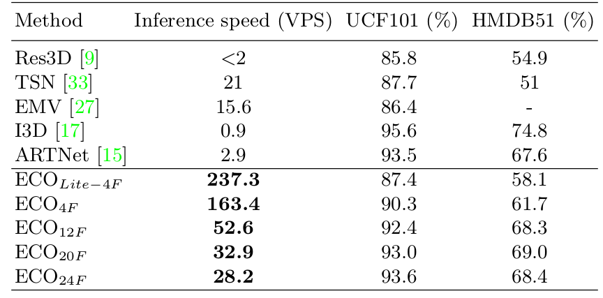

#### Code and models of [paper](https://arxiv.org/pdf/1804.09066.pdf). " ECO: Efficient Convolutional Network for Online Video Understanding" 
 By Mohammadreza Zolfaghari, Kamaljeet Singh, Thomas Brox


### Update
- **2018.7.30**: Adding codes and models
- **2018.4.17**: Repository for ECO.


### Introduction
This repository will contains all the required models and scripts for the paper [ECO: Efficient Convolutional Network for Online Video Understanding](https://arxiv.org/pdf/1804.09066.pdf).


In this work, we introduce a network architecture that takes long-term content into account and enables fast per-video processing at the same time. The architecture is based on merging long-term content already in the network rather than in a post-hoc fusion. Together with a sampling strategy, which exploits that neighboring frames are largely redundant, this yields high-quality action classification and video captioning at up to 230 videos per second, where each video can consist of a few hundred frames. The approach achieves competitive performance across all datasets while being 10x to 80x faster than state-of-the-art methods.


### Results 
Action Recognition on UCF101 and HMDB51           |  Video Captioning on MSVD dataset
:-------------------------:|:-------------------------:
  |  

### Online Video Understanding Results 
Model trained on UCF101 dataset             |  Model trained on Something-Something dataset
:-------------------------:|:-------------------------:
  |  


### Training
1. Download the initialization and trained models:

	```Shell
        sh download_models.sh
	```
 
 2- Train ECO Lite on kinetics dataset:
 
 	```Shell
        sh models_ECO_Lite/kinetics/run.sh
	```
 
 
 
### TODO
1. Data
2. Tables and Results
3. Demo


### Contact

  [Mohammadreza Zolfaghari](https://github.com/mzolfaghari/ECO_efficient_video_understanding)

  Questions can also be left as issues in the repository. We will be happy to answer them.
